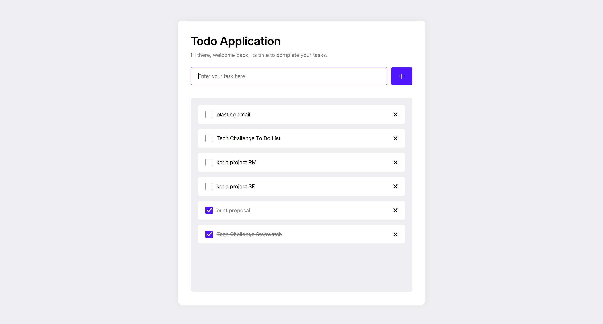

# To-Do List Tech Challenge 📝

Welcome to the **To-Do List Tech Challenge** for AkSub **FAVE**! This is a simple and interactive web-based to-do list app that allows you to manage tasks. You can add, delete, and mark tasks as complete. Built using pure **HTML**, **CSS**, and **JavaScript**, this app provides an efficient way to stay organized.

<br>

## 🚀 Live Demo

Check out the live version of the to-do list app:  
[https://todo-list-kez.vercel.app/](https://todo-list-kez.vercel.app/).

## 🛠️ Features

- **Add Task**: Easily add new tasks to your to-do list.
- **Delete Task**: Remove tasks from your list once they are completed or no longer needed.
- **Mark Task Complete**: Mark tasks as complete with a click.
- **Persistent Data**: Tasks are saved even after the page reloads (using local storage).
- **Simple Interface**: A clean and minimal design for ease of use.

## 💻 Technologies Used

- **Frontend**: HTML, CSS, JavaScript
- **Hosting**: Vercel

## 🎯 How to Use

1. Visit the [live demo](https://todo-list-kez.vercel.app/).
2. Add a new task by typing in the input box and clicking **Add Task**.
3. To delete a task, click the **Delete** button next to the task.
4. To mark a task as complete, click the **Check** button next to the task.
5. The to-do list will remain intact even after refreshing the page.

## 📸 Screenshots



## 🔧 Installation

If you want to run this project locally, follow these steps:

1. Clone the repository:
   ```bash
   git clone https://github.com/Kezota/Kezia_TechChallenge_TodoList_01.git
   ```
2. Navigate to the project directory:
   ```bash
   cd Kezia_TechChallenge_TodoList_01
   ```
3. Open `index.html` in your browser to view the web. Or open with Live Server.

## 👏 Credits

This project was built as part of a tech challenge.

## 🤝 Contributing

If you'd like to contribute to the development of this project, feel free to fork the repository and submit a pull request. Contributions are always welcome!
